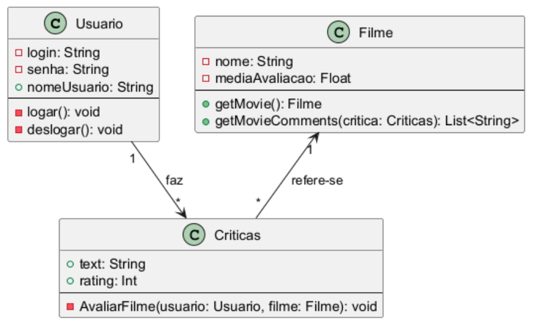
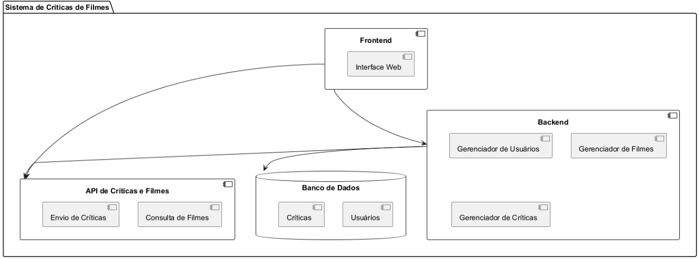
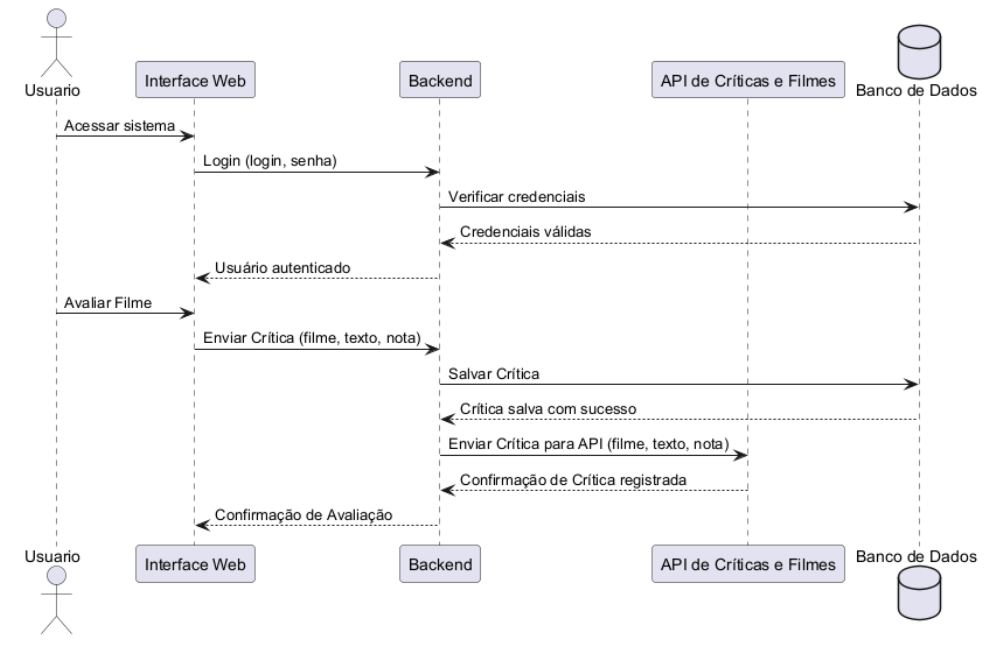
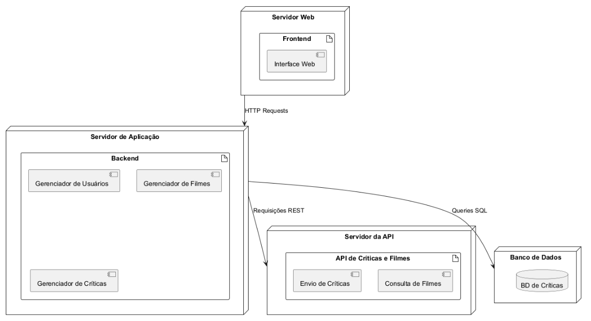
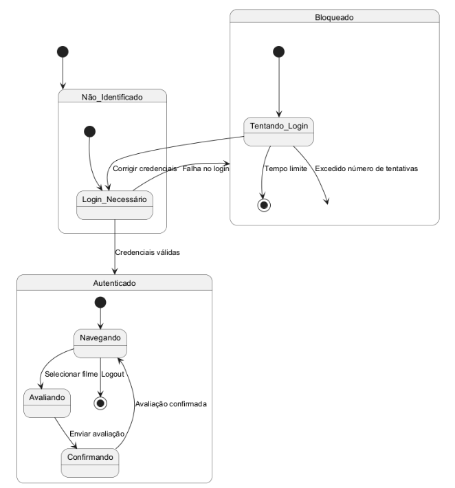
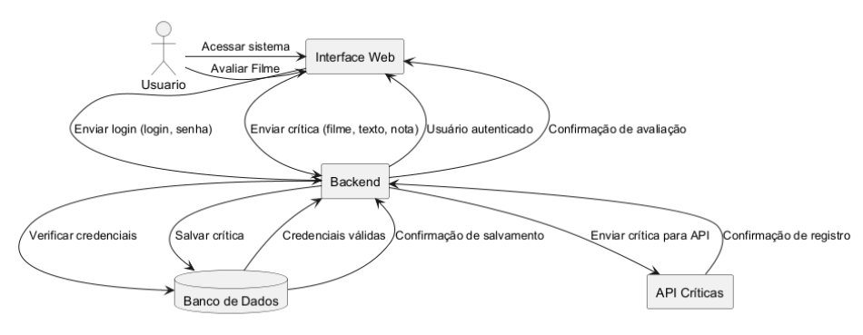

# Cinewords
 Site que irá possuir opiniões dos usuários sobre os filmes que eles assistiram

## 1. Introdução 
O objetivo do Cinewords é permitir que os usuários descubram filmes, registrem opiniões e interajam com outros usuários por meio de avaliações e críticas. Este trabalho inclui a elaboração de modelos de domínio, que representam os conceitos e entidades do sistema, e modelos de projeto, que detalham a arquitetura e as interações entre os componentes do sistema.

## 2. Histórias de Usuário

### História de Usuário 1: Fazer Login no Sistema
**Como** usuário cadastrado

**Quero** acessar minha conta no sistema

**Para** visualizar meu perfil e interagir com os recursos disponíveis, como avaliar filmes e consultar listas.

### História de Usuário 2: Avaliar um Filme
**Como** usuário autenticado

**Quero** escrever uma crítica e atribuir uma nota a um filme que assisti

**Para** compartilhar minha opinião com outros usuários e contribuir para a média de avaliação do filme.

### História de Usuário 3: Consultar Filmes Disponíveis
**Como** visitante ou usuário autenticado

**Quero** visualizar uma lista de filmes disponíveis no sistema

**Para** explorar opções de filmes e decidir quais quero assistir ou avaliar.

## Diagramas

### 1. Diagrama de Classes

### 2. Diagrama de Componentes

### 3. Diagrama de Sequência

### 4. Diagrama de Implantação

### 5. Diagrama de Estados

### 6. Diagrama de Comunicação

